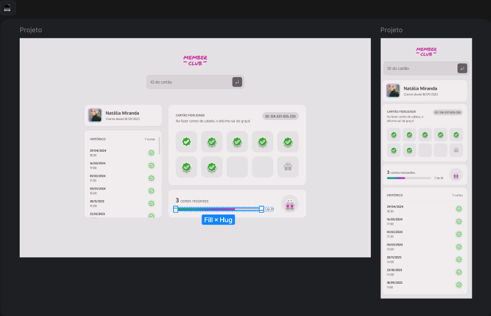
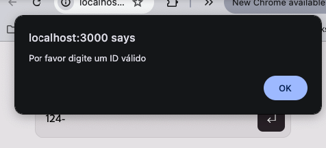
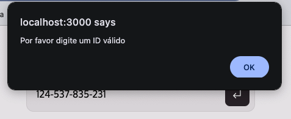
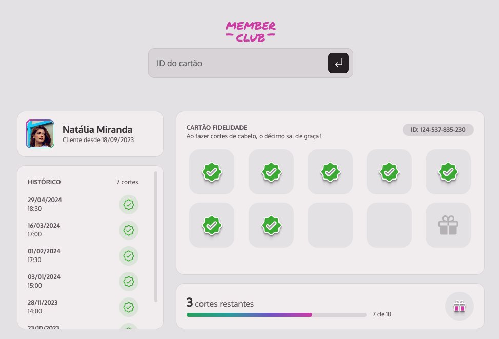
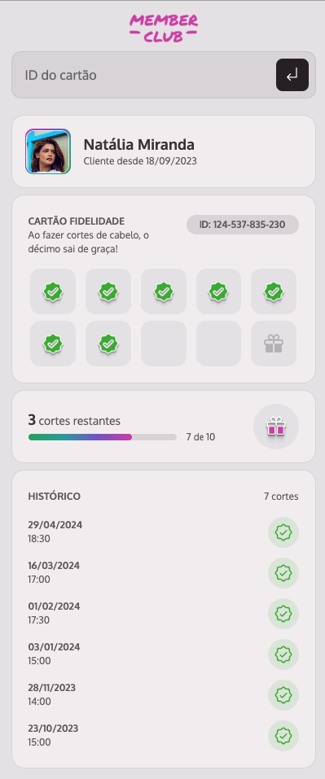

<h1 align="center">
  
</h1>

## Índice

- [1. Introdução](#1-introdução)
- [2. Member Club](#2-dogs)
- [3. Funcionalidades](#3-estrutura-e-funcionalidades)
- [4. Ferramentas Utilizadas](#4-ferramentas-utilizadas)
- [5. Considerações Finais](#5-considerações-finais)
 ---
 

## 1. Introdução
Aplicação Web desenvolvida durante o primeiro módulo do MBA de Full Stack da <strong>Rocketseat</strong> 🚀.

---
 

## 2. Member Club

O projeto consiste em desenvolver uma aplicação web <strong>responsiva</strong> de um Cartão Fidelidade.

  

 

Nesta fase do projeto o foco não é o desenvolvimento da página consimindo uma API, por isso não foi desenvolvida, 
e foi simulado uma API usando o <strong>json-server</strong>
 

O desenvolvimento foi feito pela versão do Mobile primeiro, e depois a adaptação para a web.

---
 

## 3. Funcionalidades

Como objetivo principal da entrega a aplicação deve conter as seguintes funcionalidades:
- [x] Deve ser possível buscar as informações dos clientes através de um ID;
- [x] Deve haver uma validação pra saber se é um ID válido e existente;
- [x] Deve aparecer um alerta de erro em tela caso seja um ID inválido;

Havendo sucesso em trazer os dados de cada cliente, deveria possuir umas funcionalidades adicionais:
- [x] Deve ser exibida na tela a imagem do(a) cliente;
- [x] Deve ser exibido na tela o nome do(a) cliente;
- [x] Deve ser exibido na tela o histórico de cortes com a quantidade, a data e a hora;
- [x] Deve ter um check no cartão fidelidade para cada corte de cabelo que o(a) cliente tiver;
- [x] Deve ser exibido na tela um progresso com o número de cortes restantes para o prêmio;
- [ ] Deve aparecer na tela um modal de parabéns com a mensagem: “Parabéns! Seu próximo corte é gratuito!” caso o cliente tenha atingido os 10 cortes;

Das funcionalidades descritas acima a unica que ficou para próxima versão foi o modal e parabéns quando o clinete atinge o número de cortes.

Abaixo os alerts de validação de ID inválido, primeiro digitando um valor menor do que esperado no campo input, e também ao informar um ID inexistente no campo.

  
    

E como ficou as versões WEB e Mobile:

  

  

---
 

## 4. Ferramentas Utilizadas

Para esse primeiro desafio, não era possível utilizar nenhum framework ou biblioteca para auxilio no JavaScript.
Com isso para esse projeto foi utilizado somente:
- [x] HTML
- [x] CSS
- [x] Conceitos Básicos de JavaScript
- [x] Babel
- [x] Webpack
- [x] Json-server

---
 

## 5. Considerações Finais

Ao final do projeto consegui colocar em prática todo o aprendizado durante o primeiro módulo.
Tive alguns desafios, mas consegui entregar o máximo que pude, e estou feliz com o que consegui entregar.

Obrigada aos Educadores dessa primeira etapa <strong>Mayk Brito</strong> e <strong>Rodrigo Gonçalves</strong>
